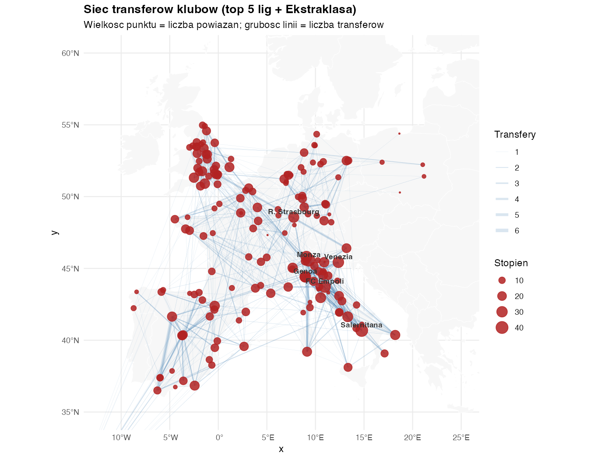
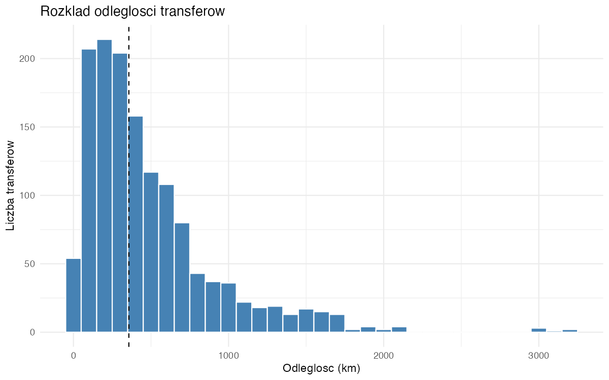
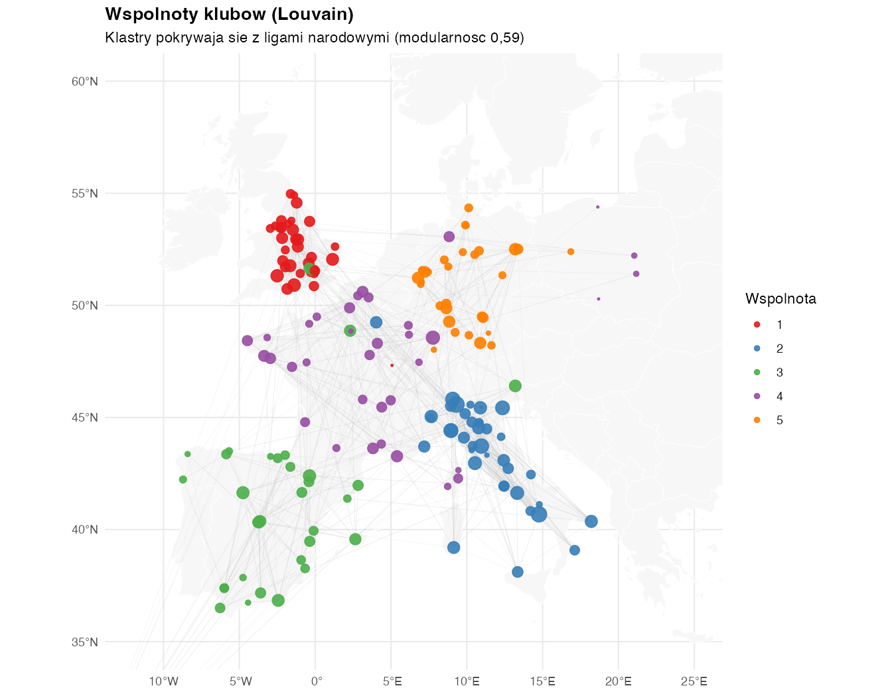
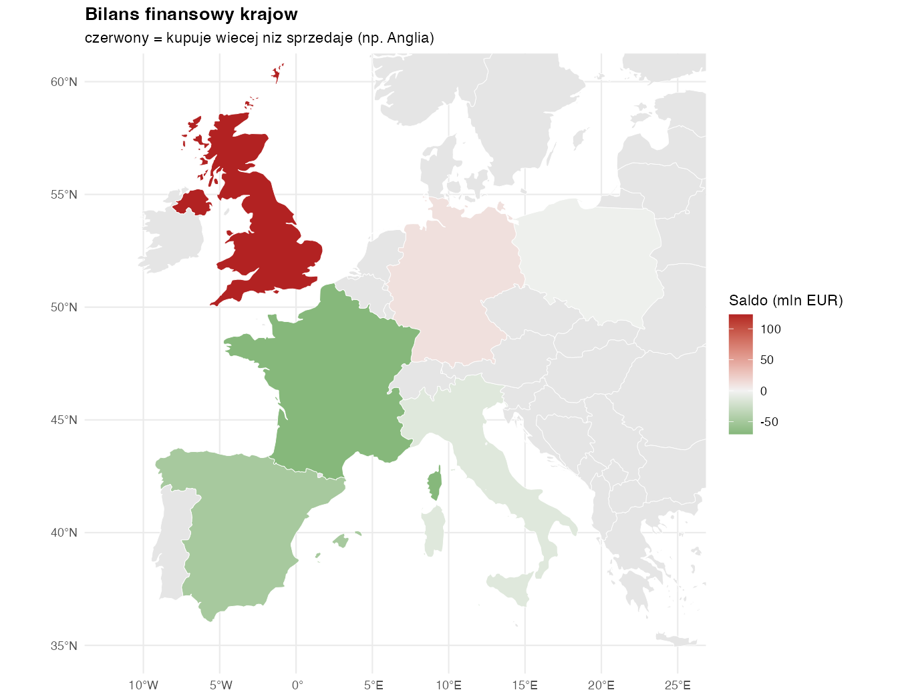

```{r}
#| label: setup
#| include: false
knitr::opts_chunk$set(echo = FALSE, warning = FALSE, message = FALSE)

library(tidyverse)
library(sf)
library(igraph)
library(knitr)

# przetworzone dane (powstaja po uruchomieniu skryptow R/01-05)
transfers <- readRDS("data/processed/transfers_clean.rds")
vt        <- readRDS("data/processed/graph_nodes_metrics.rds")
edges_sf  <- readRDS("data/processed/graph_edges.rds")
g         <- readRDS("data/processed/graph_igraph.rds")
cbal      <- read_csv("data/processed/country_balance.csv", show_col_types = FALSE)
```

# Wprowadzenie

Rynek transferowy w piłce nożnej można przedstawić jako **graf**, w którym węzłami
są kluby, a krawędziami transfery zawodników między nimi. Ponieważ każdy klub ma
konkretną lokalizację geograficzną (stadion), graf ten ma naturalny wymiar
**przestrzenny** i nadaje się do wizualizacji na mapie. Tak ujęty rynek pozwala
analizować strukturę powiązań handlowych, rolę poszczególnych klubów oraz
geografię przepływów zawodników i kapitału.

Celem projektu jest zbudowanie i analiza takiego grafu dla najważniejszych lig
europejskich oraz odpowiedź na cztery pytania badawcze:

1. Które kluby są hubami rynku i czy „usieciowienie" pokrywa się z siłą finansową?
2. Czy transfery mają charakter raczej lokalny, czy globalny?
3. Czy istnieją wspólnoty klubów handlujących między sobą i czy pokrywają się
   z granicami lig narodowych?
4. Jaki jest bilans transferowy poszczególnych krajów (import vs eksport)?

Analiza sieci złożonych oraz wizualizacja przepływów na mapach (*flow maps*) to
ugruntowane podejścia w analizie danych przestrzennych. W projekcie korzystamy
z metod teorii grafów [@igraph], danych przestrzennych typu *simple features*
[@sf] oraz algorytmu wykrywania wspólnot Louvaina [@louvain].

# Dane

Wykorzystano otwarty zbiór **Football Data from Transfermarkt** [@transfermarktdata]
(serwis Kaggle), zawierający dane o klubach, rozgrywkach i transferach zeskrapowane
z serwisu Transfermarkt i aktualizowane cotygodniowo. Z trzech plików źródłowych
(`transfers.csv`, `clubs.csv`, `competitions.csv`) zbudowano sieć transferową dla
pierwszych lig sześciu krajów (Anglia, Hiszpania, Niemcy, Włochy, Francja, Polska)
w sezonach 2021/22–2025/26. Przyjęto regułę, że oba kluby transferu należą do
analizowanych lig.

```{r}
#| label: tbl-dane
tibble(
  Zmienna = c("from_club_id / to_club_id", "transfer_fee",
              "market_value_in_eur", "transfer_season",
              "stadium_name", "lat / lon (dodane)", "country (dodane)"),
  Opis = c("identyfikatory klubu sprzedajacego i kupujacego",
           "kwota transferu (EUR); 0 dla wolnych transferow i wypozyczen",
           "wartosc rynkowa zawodnika (EUR)",
           "sezon transferowy",
           "nazwa stadionu (do geokodowania)",
           "wspolrzedne klubu (geokodowanie OSM/Nominatim)",
           "kraj ligi klubu (z pliku competitions)")
) |> kable(caption = "Najwazniejsze zmienne wykorzystane w projekcie.")
```

Po czyszczeniu i filtrowaniu sieć liczy **`r vcount(g)` klubów** (węzłów) oraz
**`r sum(edges_sf$n_transfers)` transferów** zagregowanych w `r ecount(g)` skierowanych
krawędzi (klub sprzedający → kupujący). Warstwę przestrzenną uzyskano przez
geokodowanie nazw stadionów w OpenStreetMap (Nominatim); kilkanaście klubów
o nietypowych nazwach skorygowano ręcznie.

# Metody

**Konstrukcja grafu.** Transfery zagregowano do skierowanych par klub→klub
z wagami: liczba transferów oraz suma kwot. Węzły opisano geometrią punktową,
a krawędzie — odcinkami (`LINESTRING`) łączącymi kluby; wszystkie obiekty
w układzie WGS84 (EPSG:4326).

**Centralność.** Dla każdego klubu policzono stopień wejściowy/wyjściowy oraz
pośrednictwo (*betweenness*):
$$
C_B(v) = \sum_{s \neq v \neq t} \frac{\sigma_{st}(v)}{\sigma_{st}},
$$
gdzie $\sigma_{st}$ to liczba najkrótszych ścieżek z $s$ do $t$, a $\sigma_{st}(v)$
— tych przechodzących przez $v$. Siłę finansową ujęto jako sumę kwot na krawędziach
wychodzących (sprzedaż) i wchodzących (zakupy).

**Wspólnoty.** Klastry handlowe wykryto algorytmem Louvaina, maksymalizującym
modularność:
$$
Q = \frac{1}{2m} \sum_{ij}\left(A_{ij} - \frac{k_i k_j}{2m}\right)\delta(c_i, c_j).
$$

**Odległości.** Dla każdej krawędzi policzono odległość wielkokołową (haversine):
$$
d = 2R\,\arcsin\!\sqrt{\sin^2\!\tfrac{\Delta\varphi}{2} +
\cos\varphi_1 \cos\varphi_2 \sin^2\!\tfrac{\Delta\lambda}{2}}.
$$

Analizy wykonano w R z użyciem pakietów `sf` [@sf], `igraph` [@igraph],
`tidygeocoder`, `rnaturalearth` i `tidyverse`.

# Rezultaty

## Huby sieciowe a finansowe

```{r}
#| label: tbl-hubs
vt |> arrange(desc(deg_total)) |>
  transmute(Klub = club_name, Kraj = country,
            `Stopien` = deg_total, Betweenness = round(betw)) |>
  head(8) |> kable(caption = "Najwieksze huby sieciowe (liczba powiazan).")
```

```{r}
#| label: tbl-money
left_join(
  vt |> arrange(desc(fee_received)) |>
    transmute(Sprzedajacy = club_name, `Sprzedaz (mln)` = round(fee_received/1e6,1)) |> head(6),
  vt |> arrange(desc(fee_spent)) |>
    transmute(Kupujacy = club_name, `Zakupy (mln)` = round(fee_spent/1e6,1)) |> head(6) |>
    mutate(r = row_number()),
  by = character()
) |> select(-r) |>
  kable(caption = "Najwieksi sprzedajacy i kupujacy (mln EUR).")
```

Najlepiej „usieciowione" są średniej wielkości kluby włoskie krążące między Serie A
i B, ponieważ wymieniają zawodników z wieloma różnymi klubami. Siła finansowa leży
jednak gdzie indziej: po stronie zakupów dominują kluby angielskie (Premier League).
Wniosek: liczba powiązań mierzy aktywność handlową, a nie znaczenie finansowe.

{#fig-siec width=95%}

## Odległości transferów

```{r}
#| label: dist-calc
dvec <- rep(st_drop_geometry(edges_sf)$dist_km, st_drop_geometry(edges_sf)$n_transfers)
```

Mediana odległości transferu wynosi **`r round(median(dvec))` km**, a średnia
**`r round(mean(dvec))` km**. Transfery lokalne (poniżej 300 km) stanowią
**`r round(mean(dvec<300)*100)`%**, a dalekie (powyżej 1000 km) —
**`r round(mean(dvec>1000)*100)`%**. Przewaga średniej nad medianą wskazuje na
prawoskośny rozkład: handel odbywa się głównie blisko, lecz istnieje wyraźny ogon
transferów dalekich.

{#fig-dist width=80%}

## Wspólnoty klubów

```{r}
#| label: comm-calc
gu <- igraph::as_undirected(g, mode = "collapse",
        edge.attr.comb = list(n_transfers = "sum", "ignore"))
set.seed(1)
comm <- cluster_louvain(gu, weights = E(gu)$n_transfers)
```

Algorytm Louvaina wyodrębnił **`r length(comm)` wspólnot** przy wysokiej
modularności **`r round(modularity(comm), 3)`**. Wspólnoty niemal idealnie
pokrywają się z ligami narodowymi (osobne klastry: włoski, hiszpański, angielski,
francuski, niemiecki), a kluby Ekstraklasy rozdzielają się między klaster francuski
i niemiecki. Oznacza to, że europejski rynek transferowy jest silnie **podzielony
wzdłuż granic lig narodowych** — kluby handlują przede wszystkim w obrębie własnej ligi.

{#fig-comm width=95%}

## Bilans transferowy krajów

```{r}
#| label: tbl-balance
cbal |>
  transmute(Kraj = country, `Sprzedani` = players_sold, `Kupieni` = players_bought,
            `Przychod (mln)` = round(revenue/1e6),
            `Wydatki (mln)`  = round(spending/1e6),
            `Saldo (mln)`    = net_spend_mln) |>
  arrange(desc(`Saldo (mln)`)) |>
  kable(caption = "Bilans transferowy krajow (dodatnie saldo = platnik netto).")
```

Anglia jest zdecydowanie największym płatnikiem netto, co potwierdza obraz Premier
League jako ligi przepłacającej za zawodników. Po przeciwnej stronie znajdują się
eksporterzy — Francja, Hiszpania i Włochy — sprzedający zawodników z dodatnim
saldem finansowym.

{#fig-choro width=95%}

# Podsumowanie

Zbudowano przestrzenny graf transferów dla sześciu czołowych lig europejskich
i odpowiedziano na wszystkie cztery pytania badawcze. Wykazano, że (1) aktywność
sieciowa nie pokrywa się z siłą finansową, (2) rynek jest umiarkowanie lokalny,
(3) wykazuje silną strukturę wspólnotową odpowiadającą ligom narodowym oraz
(4) charakteryzuje się wyraźnym podziałem na płatników (Anglia) i eksporterów
(Francja, Hiszpania). Cele projektu zostały osiągnięte.

**Ograniczenia.** Przyjęta reguła „oba kluby w ligach docelowych" pomija transfery
spoza analizowanych lig (np. sprzedaż do Portugalii czy Ameryki Płd.), a brak kwoty
dla części transferów (wypożyczenia, wolne transfery) zaniża sumy finansowe. Możliwe
rozszerzenia: poszerzenie zakresu o transfery z jednym końcem w ligach docelowych
(uwidoczni globalny eksport i mocniej Polskę), wiązanie krawędzi (*edge bundling*)
dla czytelniejszej mapy oraz wersja interaktywna (`leaflet`).

# Literatura

::: {#refs}
:::

# Aneks — listing kodu

```{r}
#| label: aneks-01
#| eval: false
#| echo: true
#| file: R/01_load_clean.R
```

```{r}
#| label: aneks-02
#| eval: false
#| echo: true
#| file: R/02_geocode.R
```

```{r}
#| label: aneks-02b
#| eval: false
#| echo: true
#| file: R/02b_fix_coords.R
```

```{r}
#| label: aneks-03
#| eval: false
#| echo: true
#| file: R/03_graph.R
```

```{r}
#| label: aneks-04
#| eval: false
#| echo: true
#| file: R/04_analysis.R
```

```{r}
#| label: aneks-05
#| eval: false
#| echo: true
#| file: R/05_viz.R
```
